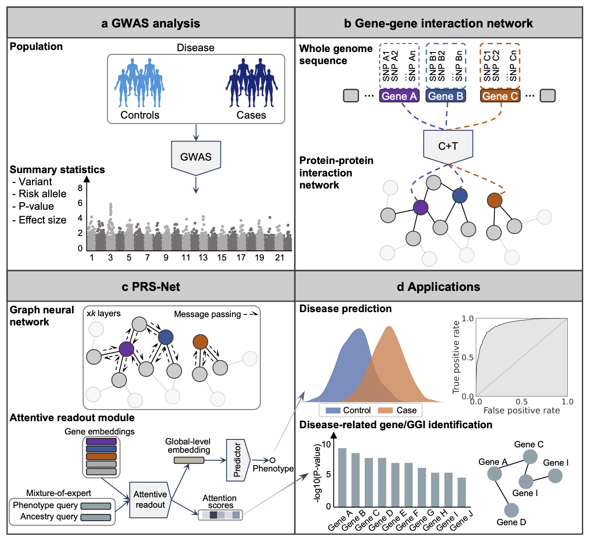

# PRS-Net
## About
This repository contains the code and resources of the following paper:

PRS-Net: Interpretable polygenic risk scores via geometric learning

## Overview of the framework
PRS-Net is an interpretable genomic deep learning-based approach designed to effectively model the nonlinearity of the biological system and deliver more precise PRS predictions.

 

## **Setup environment**
Setup the required environment using `environment.yml` with Anaconda. While in the project directory run:

    conda env create

Activate the environment

    conda activate PRS-Net

## **Download example dataset**
We upload an example dataset at [[https://figshare.com/s/8bbb8cad9ac644bf9caa](https://cloud.tsinghua.edu.cn/f/30a1c8df0c024fefa3c1/?dl=1)].

Unzip the file and put it in example_dataset/.

## **Train**

    python train.py --data_path ../example_dataset/ --dataset ad_eur

## License
PRS-Net is licensed under the Apache License, Version 2.0: http://www.apache.org/licenses/LICENSE-2.0.

